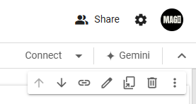
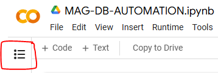
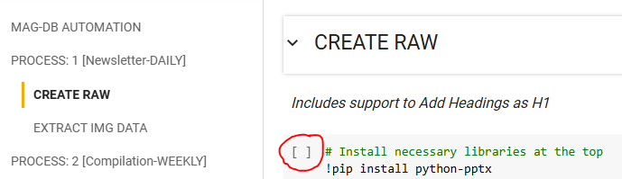
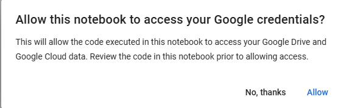
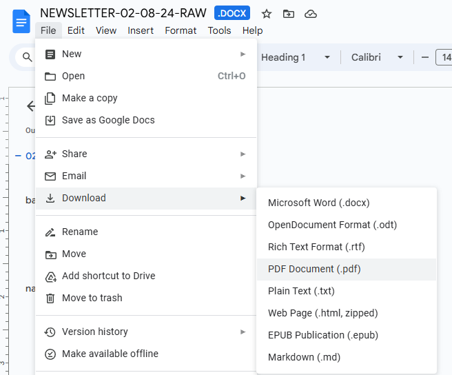

# RAW File \<Newsletter>

<figure><figcaption><p>Image: Diagram Process of Newsletter</p></figcaption></figure>

## STEP 1: File Arrives

### DISCORD:&#x20;

A notification with <@username> will alert the designer upon file arrival in "#newsletter-daily" channel.

### GOOGLE DRIVE

1. Make a Copy of <.pptx> file from Shared Folder into "My Drive"
2. Rename this <.pptx> file in this format: DD-MM-YY.pptx (Ex: 01-01-24.pptx)

## STEP 2: File Conversion

### GOOGLE CODE COLABORATORY



Connect to the Server (Locate the Option on Top Right Corner)

<figure><figcaption><p>Connect with Cloud Server</p></figcaption></figure>

Open Table of Content (Locate on the Top Left Corner)

<figure><figcaption><p>Open Colab Index</p></figcaption></figure>

Go to CREATE RAW Under PROCESS 1 : \[Newsletter-Daily] and Run It

<figure><figcaption><p>Run the Cell</p></figcaption></figure>

Allow Access to Google Credentials and Google Drive

<figure><figcaption><p>Allow</p></figcaption></figure>

<figure><figcaption><p>Connect to Google Drive</p></figcaption></figure>

Enter the Exact <.pptx> filename into the Input Field

<figure><figcaption><p>Example Image: 02-08-24.pptx</p></figcaption></figure>

Go to EXTRACT IMG DATA Under PROCESS 1 : \[Newsletter-Daily] and Run It

<figure><figcaption><p>Run the Cell</p></figcaption></figure>

Enter the Exact <.pptx> filename into the Input Field

<figure><figcaption><p>Example Image: 02-08-24.pptx</p></figcaption></figure>


## STEP 3: File Processing

### GOOGLE DRIVE

* Select and Cut {Ctrl+X} all 3 Items (Img Folder + Newsletter + PPTX)&#x20;
* Paste into this Location:  My Drive / MAGDB / Month / Daily-Newsletter

### GOOGLE DOCS

Open the Newsletter Docs file for formatting as Instructed below in video:

#### WATCH VIDEO GUIDE




Properly Identify Headings using pptx file as reference.

Remove Non-Heading type Content and make them as "Normal-Text" instead.

CHECK: Dual Tables on Single Slides, Fix them.

Remove repetitive occurrence of the word: "NEWSLIDE" using CTRL + H.


### MCQ Table /w AI

#### ChatGPT

After the Docs file is edited as instructed above, we'll save the file as PDF

<figure><figcaption><p>Save the File as PDF</p></figcaption></figure>

Upload this PDF file to ChatGPT and Give this Prompt to find Top 5 MCQs:


Read each Question and ask for modification from ChatGPT if required.


```
I'm giving a file which contains current affairs news from various categories,
Give me top 5 good questions with single words or short answers from this file.
Make a table for 2 columns and 6 rows,
Header row consist of Q in one volume and A in 2nd column.
Rest rows simultaneous Question Answers one by one.
```

#### Perplexity AI

The table generated by ChatGPT is not directly copyable into our docs file hence we'll use the perplexity to format into a proper table for direct copying.

Use the Qs generated by ChatGPT to be restructured into a copyable proper table format.

Copy the Output Generate table and paste it into Newsletter-Docs-File.&#x20;


Ensure the Output table matches the Input table data.


```
Convert given data into a table for 2 columns and 6 rows,
Header row consist of Q in one volume and A in 2nd column.
Rest rows simultaneous Question Answers one by one.
```

### NOTION

Update the **STATUS** to: "In-Progress"

Paste the Link to docs file in **INPUT-RAW-URL**

## STEP 4: File Designing

Watch this video to understand the complete design process:



### CANVA

* Open the associated Design File of Newsletter.
* Use the Newsletter Docs File to update the Design file to Latest Content.
* Insert Images into Design File using the Drive Folder containing the extracted Images.
* Insert Hyperlinks of the associated Newsletter LIVE Sessions.

#### YOUTUBE

* Open the Channel ([https://www.youtube.com/@Studyniti/streams](https://www.youtube.com/@Studyniti/streams)) and Find associated LIVE Stream URL.
* If URL is not found, the default link to channel must be preserved.

## STEP 5: File Cross-Checking

* Check Consistency of Newsletter Content in the final design using the Raw Newsletter Docs File in Split Screen Mode.
* Check for any possible repetition of any content or any unwanted errors.
* Open the Attached URLs of Live Stream to check their workability.
* Check the MCQs: The Qs table and Answer table should be correctly updated to today's version of the Newsletter.

SHARE > DOWNLOAD > File type: PDF Print (All Pages) > \[DOWNLOAD]

## STEP 6: Final File Upload

### GOOGLE DRIVE

Upload the file to the **"Newsletter-Daily-FINAL"** folder after Completing the checking.&#x20;

Copy the Link to this uploaded final Newsletter PDF File.&#x20;

### NOTION

Update the **STATUS** to: "Done"

Update the **"Pass 1"** to Checked.

Update the **Pages** of PDF:&#x20;

Paste the Link to PDF file in **OUTPUT-URL**

#### WATCH VIDEO GUIDE


