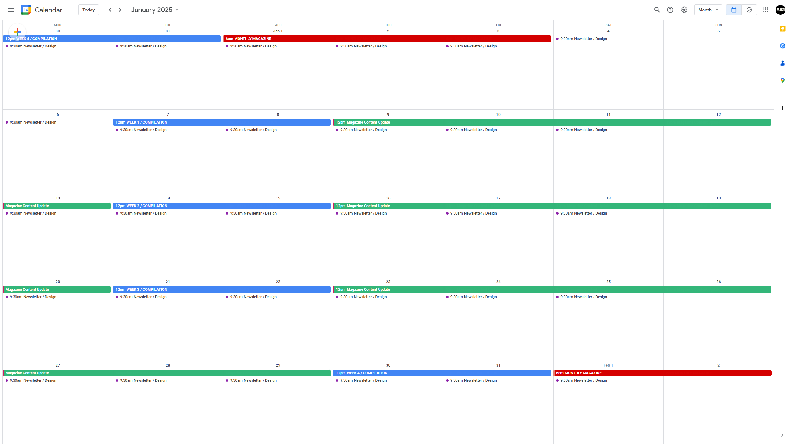

# MAG/Finalisation

<figure><figcaption></figcaption></figure>

## STEP 1: Pre Update

#### DISCORD

You'll receive reminders for this purpose in **#magazine-monthly** Discord Server Channel.

#### NOTION

Update the **STATUS:** "In-Progress"

After each weekly file is designed we have to update the same content in all 5 sections of Monthly Magazine. Open in CANVA: **PROJECTS > MAGDB-Designs > MONTHLY MAGAZINE.**

| FILENAME         | UPLOADED ON:               | UPDATE MAGAZINE CONTENT   |
| ---------------- | -------------------------- | ------------------------- |
| WK-1-Compilation | On 08th before 03:30PM IST | 09th to 14th              |
| WK-2-Compilation | On 15th before 03:30PM IST | 16th to 21st              |
| WK-3-Compilation | On 22nd before 03:30PM IST | 23rd to Month's last date |
| WK-4-Compilation | On 01st before 03:30PM IST | Immediately               |

In the image below, you can notice the green coloured dates on the calendar. This is the time when you'll be updating the content into Magazine Sections whenever possible as per your schedule. The status of Weekly Data Content being updated in Monthly File is known to you at all times and must be managed properly in order to avoid last moment rush when the Month is about to end and the deadline for Monthly Magazine Publishing is nearby.

<figure><figcaption></figcaption></figure>

## STEP 2: Files Preparation

After Week 4 Compilation is designed we'll have to immediately shift our focus on the Monthly Magazine on High Alert and begin the process of finalising the Magazine for the previous Month.

#### DISCORD

You'll receive reminder to prepare RAW FILES for this purpose in **#magazine-monthly** Discord Server Channel.

<table><thead><tr><th width="321">RAW FILES (You'll Receive)</th><th>You'll Convert Into</th></tr></thead><tbody><tr><td>100 MCQs (Unformatted)</td><td>100 MCQs (Formatted by Types 1/2/3) + Answer Key (Using Formatted File)</td></tr><tr><td>Cracker Shots (Unarranged)</td><td>Cracker Shots (Arranged Tabular Data)</td></tr></tbody></table>

LIST OF FILES (To be Made)

| FILE NAME                                                                            | VIDEO-GUIDE                                                                                                                                                                                                                                                                                                                                                                                                          |
| ------------------------------------------------------------------------------------ | -------------------------------------------------------------------------------------------------------------------------------------------------------------------------------------------------------------------------------------------------------------------------------------------------------------------------------------------------------------------------------------------------------------------- |
| Important Days                                                                       | [https://drive.google.com/file/d/1R4LAiCiFA-gHSJgNTvD1uDH2PszRThWz/view?usp=drive\_link](https://drive.google.com/file/d/1R4LAiCiFA-gHSJgNTvD1uDH2PszRThWz/view?usp=drive_link)                                                                                                                                                                                                                                      |
| Book Covers                                                                          | 
Part 1:  <a href="https://drive.google.com/file/d/1Z-JSP3RYNzExzaiow6gspOrHTywwIuFZ/view?usp=drive_link">https://drive.google.com/file/d/1Z-JSP3RYNzExzaiow6gspOrHTywwIuFZ/view?usp=drive_link</a> Part 2: <a href="https://drive.google.com/file/d/1t6Vr4sN6ULjBnMkqjS-c3SEnu0WlF1O-/view?usp=drive_link">https://drive.google.com/file/d/1t6Vr4sN6ULjBnMkqjS-c3SEnu0WlF1O-/view?usp=drive_link</a>
 |
| Static Awareness                                                                     | [https://drive.google.com/file/d/1uz4rb8eMOm48fhb6PbV7ZrORbn5DRs0u/view?usp=drive\_link](https://drive.google.com/file/d/1uz4rb8eMOm48fhb6PbV7ZrORbn5DRs0u/view?usp=drive_link)                                                                                                                                                                                                                                      |
| Cracker Shots (Arranged Tabular Data)                                                | [https://drive.google.com/file/d/1MC3j0zpDsFYLNd7S2n-3xPuSddIvQqdO/view?usp=drive\_link](https://drive.google.com/file/d/1MC3j0zpDsFYLNd7S2n-3xPuSddIvQqdO/view?usp=drive_link)                                                                                                                                                                                                                                      |
| 
100 MCQs (Formatted by Types 1/2/3) + Answer Key (Using Formatted File)
 | [https://drive.google.com/file/d/12OrU7n5cyYNMAols8huNPbkDJsvh1ha\_/view?usp=drive\_link](https://drive.google.com/file/d/12OrU7n5cyYNMAols8huNPbkDJsvh1ha_/view?usp=drive_link)                                                                                                                                                                                                                                     |

## STEP 3: Designing

You'll find 6 Files in CANVA: **PROJECTS > MAGDB-Designs > MONTHLY MAGAZINE.**

**There are 5 Section Files and 1 Common Final File.**

**Common Final File is a Template for Magazine Editing which contains pages of front and back whose design remains same and only few elements like Month Name / Index / Cover Page etc gets changed.**&#x20;

1. **Create a Duplicate of this Common Final File before starting any edit on this.**
2. **Now use split screen mode with Sections to insert a batch of 20 pages one by one from each section.**
3. **Rename this CANVA file in this Format: MONTH-YEAR-CROSSWORD-Magazine.pdf**
4. **Modify these things on their respective pages:**

<table data-view="cards"><thead><tr><th></th><th></th></tr></thead><tbody><tr><td><strong>FRONT PAGE</strong> </td><td>
Highlights

Month Name

Cover Photo   
</td></tr><tr><td><strong>PREFACE</strong></td><td>2xMention(Previous-Month-Name)  </td></tr><tr><td><strong>TABLE-OF-CONTENTS</strong>   </td><td>
Page No

3 x HD-Images
</td></tr><tr><td><strong>INSERT PAGES after "Table of Contents"</strong></td><td>
Section 1

Section 2

Section 3

Section 4

Section 5
</td></tr><tr><td>LAST-PAGE </td><td>Month-Name</td></tr></tbody></table>

### FIND EMPTY SPACES

In the last pages of Common Final file you'll find 4 different types of Ads pictures, select them all for Copying. Now find possible ad spaces in the whole magazine file using Grid View option located on the bottom right corner in Canva. Paste the Ads one by one such that every Advertisement gets a fair representation using sequential placing of each of them. Watch the Video Guide to understand the placement of all Ads.

## STEP 4: Checks/Bold/Numbering

### Ensure Checking:

* Month Name of Dates in the Topic: Important Days.
* Numbering of Content: National/State/International/MCQ Qs
* MCQ Qs: Only 100 Qs + No Qs Repetition + Verify Answer Key
* Maintain Proper Numbering of 1/2/3; Statements in TYPE-2 MCQ Qs

### Bold Highlights

* Awards & Recognition: Names
* Brand Ambassador: Names
* Books & Authors: Author Name
* Important Days: THEMES
* Visits & Summits: Locations
* Obituary Person: Name
* Static Awareness: All Headings

### Numbering

#### DOWNLOAD BACKSIDE MAGAZINE CONTENT

* Select Page Number Range from “Appointments” to Last Page (example: 9-220)
* Share > Export > Print as PDF (Pages in Range)>Download a Free Watermarked Draft
* Go to this URL: https://smallpdf.com/add-page-numbers-to-pdf


Upload PDF for Numbering


* Go to this URL: https://smallpdf.com/add-page-numbers-to-pdf
* Upload the Downloaded-File for Numbering as per Settings below.

<figure><figcaption>
Select the Bottom Right Corner for Numbering
</figcaption></figure>

* Download the Numbered Downloaded-File PDF

#### UPDATE PAGE NO. ON TABLE OF CONTENTS

Use Split Screen Mode to Simultaneously Insert Correct Page Numbering

#### DOWNLOAD FRONTSIDE MAGAZINE CONTENT

* Select Page Number Range from “Front Cover” Page to “Table of Contents” Page (example: 1-8).
* Share > Export > Print as PDF (Pages in Range)>Download a Free Watermarked Draft.

## Step 5: Merge & Rename

### MERGE BOTH FILES (FRONT + BACK)



[https://www.adobe.com/in/acrobat/online/merge-pdf.html](https://www.adobe.com/in/acrobat/online/merge-pdf.html)

* Use this URL:
* First Upload; FRONTSIDE
* Second Upload: BACKSIDE
* Merge Both files to Combine as One Single PDF

### RENAME THE FINAL MERGED PDF

* Rename the file in format= PREVIOUS-MONTH+YEAR+CROSSWORD+Current-Affairs.pdf]
* (Example: JULY24-CROSSWORD-CurrentAffairs.pdf)

#### FRONT COVER PAGE (EDITABLE PHOTOSHOP FILE)


DOWNLOAD


#### WATCH VIDEO GUIDE


WATCH

