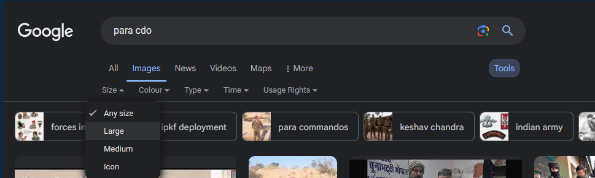

# 3D Book Covers

## STEP BY STEP APPROACH

### STEP 1: Find High Quality Images for the Book Cover

* Copy the Headline of News from "Books & Author" Pages in \<RAW-MONTH.docx>
* Paste it into Google Search Bar


Read the Headline to identify the **name of author** and **name of book**, these 2 terms will help you in properly finding the Images of the Book Covers.

WATCH **PART 1 OF THE VIDEO GUIDE** LINKED AT THE END OF THIS PAGE, TO UNDERSTAND HOW TO FIND IMAGES.


#### Get a High-Quality Image for the Book Cover

1. Enter the Target Search result you want to search about.
2. By Default, you'll be in "All" tab, Now Go to "Images" tab.
3. At the Right Corner you can see the "Tools" \<Click on it>.
4. Set Size to "Large".

<figure><figcaption>
SEARCH OPERATION SET TO "LARGE SIZE IMAGE" in Google
</figcaption></figure>

#### What if ?

#### Q1: Can't find a High Quality Book Cover Image.

-> You can try searching some different terms related to the book, in the end if still can't find any than download a low quality image and upscale it with AI using this tool below:

#### HOW TO CONVERT WEBP IMAGES TO PNG FORMAT?

1. Open the URL below and upload files you want to convert.



2. Start Conversion and Download your Images.

#### HOW TO UPSCAL WITH AI ?

1. Create a free account using Google Sign-Up on www.picwish.com \<Use Link Below>

{% embed url="https://picwish.com/signup?return_url=https%3A%2F%2Fpicwish.com%2F" %}

2. Upload Image to this Tool using this URL and download the unblurred final result



#### Q2: Found an Image of Book but a person is holding it in hands?

In such a case upscale that image and then crop it to the size of book cover then again upscal

#### Q3: Can't find any Image for the Book Cover?

Create an A4 size design in canva, give the backgriund a decent colour then write the name of book in centre of page and use that for 3D Mockup.

### STEP 2: Create 3D Mock-ups using Photoshop Template&#x20;

WATCH **PART 2 OF THE VIDEO GUIDE** TO UNDERSTAND THE PROCESS OF CREATING BOOK COVERS.

#### DOWNLOAD BOOK COVER PHOTOSHOP EDITABLE FILE


PSD FILE


#### WATCH VIDEO GUIDE


PART 1



PART 2

