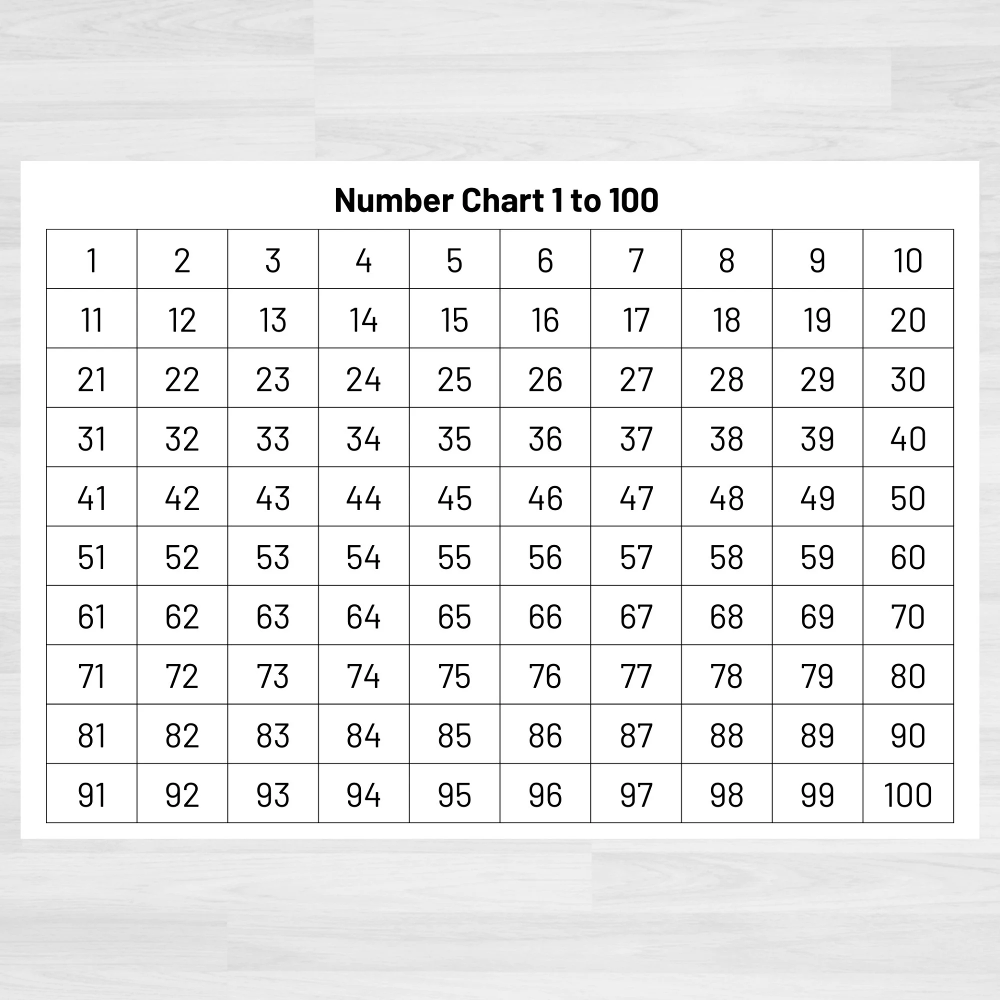

# Current Affairs

## STEP BY STEP APPROACH

### STEP 1: Identify Q's Types

*   Open the <.docx> FILE in editing mode and mark each Question on the basis of their types.

* You can also convert <.docx> into <.pdf> for easily marking or colour coding the types for identification.



<table data-view="cards"><thead><tr><th></th><th></th><th></th></tr></thead><tbody><tr><td><h4>Type 1 (T1)</h4>
Simple - Straightforward
</td><td></td><td></td></tr><tr><td><h4>Type 2 (T2)</h4>
Consider the following 
</td><td></td><td></td></tr><tr><td><h4>Type 3(T3)</h4>
Match the Correct Pairs
</td><td></td><td></td></tr></tbody></table>

<figure><figcaption></figcaption></figure>

### STEP 2: Arrange Qs in format: T1-> T2-> T3

#### Find all T2  Types and Take them towards the end of FILE

#### Find all T3  Types and Take them towards the end of FILE

At this Point, all our Questions are arranged in the T1-> T2-> T3 style but their Question Numbers are unordered and we need to fix this.

### STEP 3:  Correct the Sequence of Question No. Markings

* Delete Old Unorganised Question Number Markings.
* ADD New Question Numbers starting from 1 to 100.


ATTENTION: If you find duplicate Questions or Missing Questions (All total must be 100) While arranging Questions and Adding New numbers, immediately report to the MANTAVYAM TEAM to get this fixed.


At this point, we've a properly arranged and ordered document which we'll use for our final edits.

### STEP 4: Find Answers and Cross Verify Them

* Highlighted Coloured Text in the Options is the Correct Answer to that particular Question.
* Record Answers to all Questions :

Create a Separate <.docx> or note down with a pen-paper or use the img below to mark on it.

<figure><figcaption></figcaption></figure>


DOWNLOAD 1-100 CHART IMAGE


#### CROSS VERIFICATION IN SPLIT SCREEN MODE


ATTENTION: Double Check and Cross Verify the Answers you've noted before updating in the Final Design. It is your responsibility and duty to avoid any errors in answer key. Students will learn from this and you must ensure it's correctness.


#### WATCH VIDEO GUIDE


