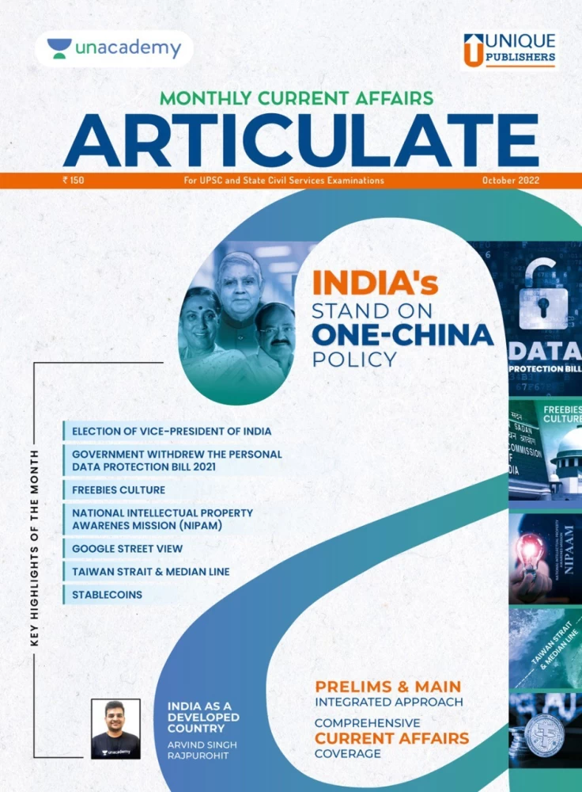
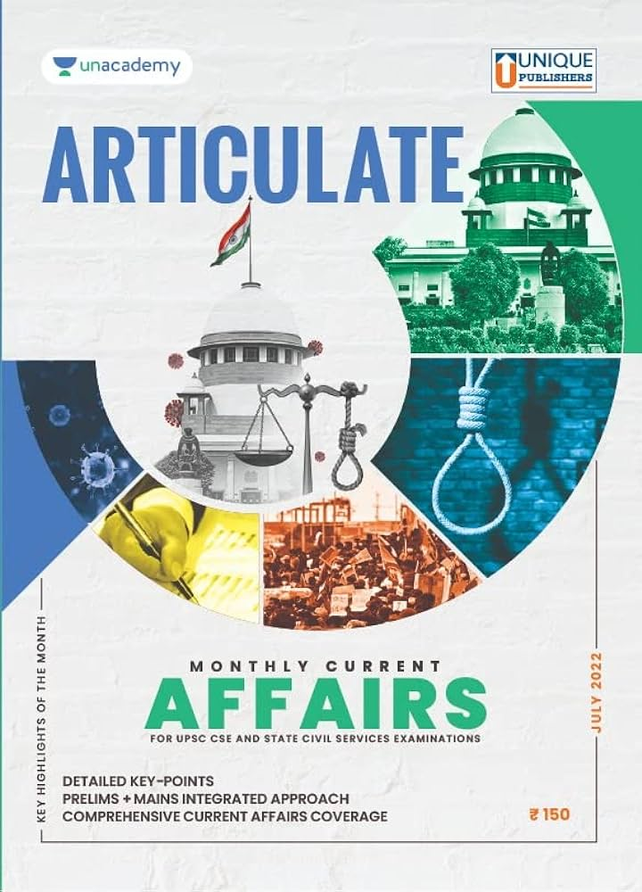
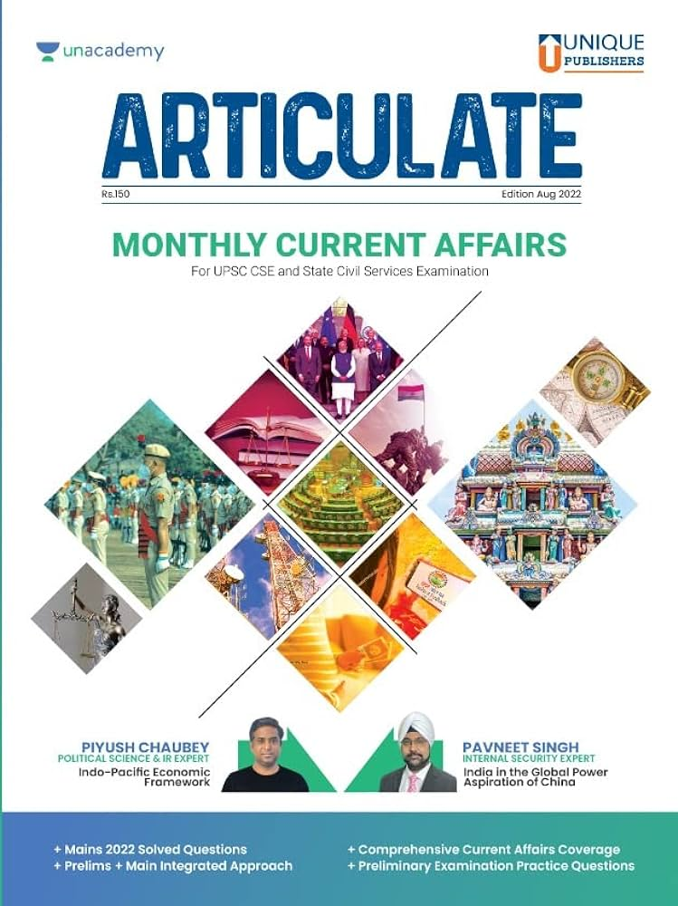
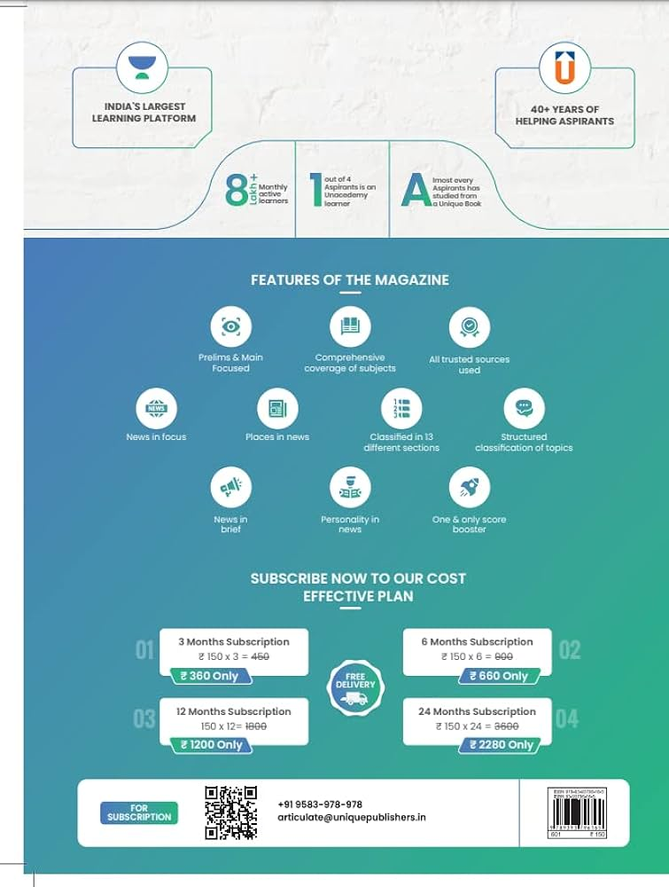
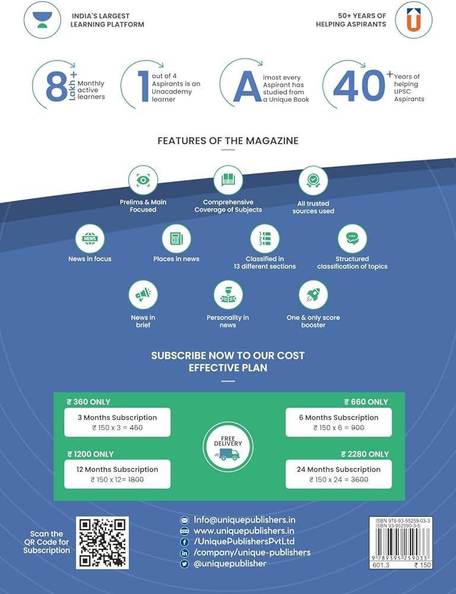

# Photoshop Poster Design

## BASICS OF PHOTOSHOP

### Watch this Playlist to Gain a Basic Understanding of Photoshop


CLICK TO WATCH


## FRONT COVER - DESIGNS

Click on Tabs below (1,2,3) to view different Versions of Examples



<figure><figcaption></figcaption></figure>



<figure><figcaption></figcaption></figure>



<figure><figcaption></figcaption></figure>



## BACK COVER - DESIGNS



<figure><figcaption></figcaption></figure>



<figure><figcaption></figcaption></figure>


