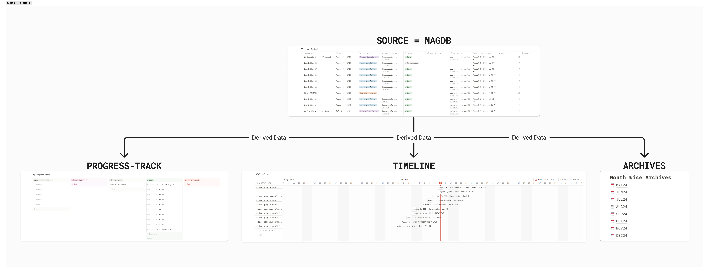
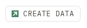

# DATABASE: Updating MagDB

## View of Database:

<figure><figcaption>
MAGDB - Database Elements Snapshot
</figcaption></figure>

## Structure of Database:

<figure><figcaption>
Diagram of Connection
</figcaption></figure>



## Elements of MAG-DB:

### Main Database: MAG-DB

The core of this page is a database named "MAG-DB". This database is used to manage magazine content and is visualized in multiple ways:


You only need to edit the "Latest-Content" View of MAG-DB, Other Child Views will be automatically updated.


### Database Views

The MAG-DB database is presented in three different views:

These views offer different perspectives on the same data, tailored for specific needs:

1. **Latest-Content**: Shows the most recent entries.
2. **Progress-Track**: Monitor the status of various content pieces.
3. **Timeline:** A chronological view of publication dates.

### Database Properties

* **Content:** Name of the content for page entry in MAG-DB.
* **Date:** The date associated with the entry of data.
* **Type-Select:** For content type categorization (Daily/Weekly/Monthly/Special)
* **INPUT-RAW-URL:** Link to Google Docs file
* **Status:** Display Current Progress (Await Input/Input Sent/In Progress/Not Streamed/Done)
* **OUTPUT-File:** Used only when there's an error in Drive File Upload. (<5mb)
* **OUTPUT-URL:** Link to uploaded PDF in Final Drive Folder.
* **Last edited time:** Tracks when the entry was last modified
* **Pages:** To track page count
* **Remark:** Additional notes (Late-Input/Evening-Stream/Under-Revision)

### Monthly Archives

The page includes a section for monthly archives. Each month is represented as a child page. These child pages contain content specific to each month, allowing for easy organization and access to month-based information.

## Create Entry in MAGDB

On Top of the Page, you'll find a Green Coloured Button.

<figure><figcaption>
Click on CREATE DATA
</figcaption></figure>

<figure><figcaption>
Select "CONTINUE"
</figcaption></figure>

<figure><figcaption>
Enter Data for the Entry you want to Create.
</figcaption></figure>

#### WATCH VIDEO GUIDE



