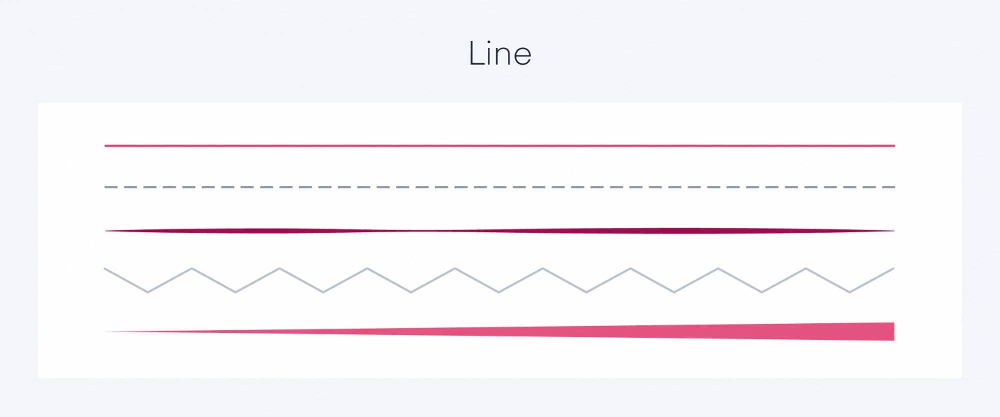
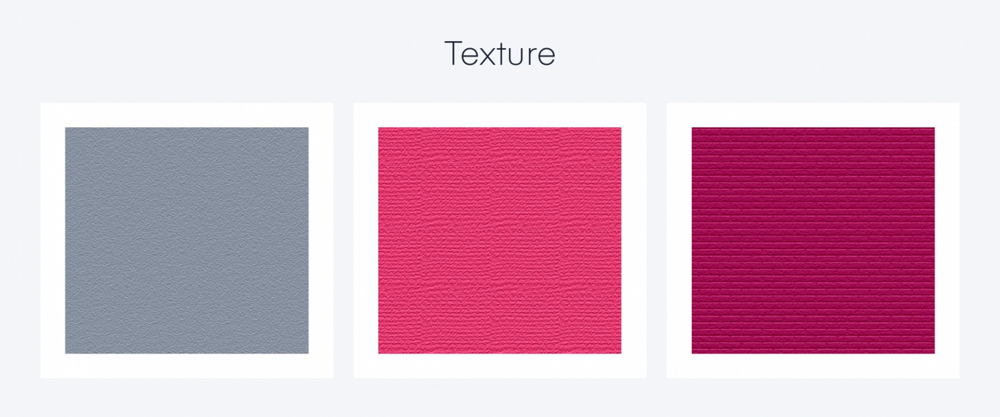
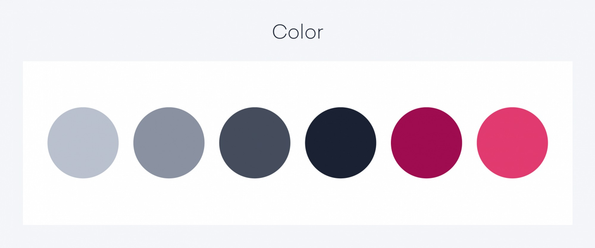
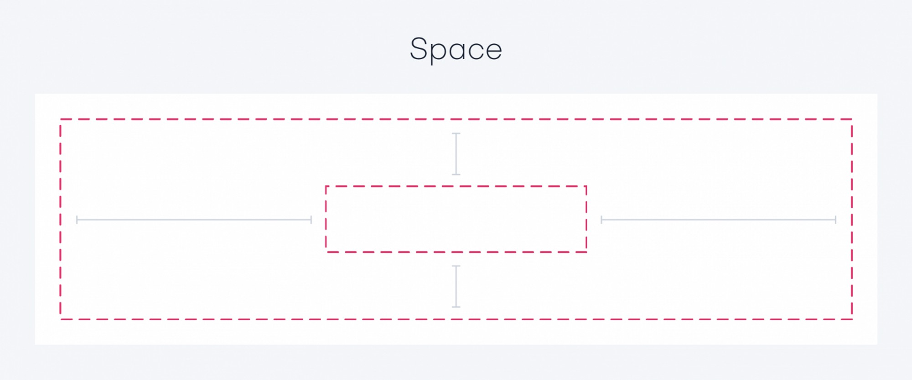

# Design

### Wh**at matters in a Design?**

Every piece of design work is made up of design elements and design principles. When the principles are combined and used correctly, a design commands your attention and is hard to ignore. The design guides your eye through the story, keeping you visually entertained and engaged.

> In order to understand the aesthetic in its ultimate and approved forms, one must begin with it in the raw; in the events and scenes that hold the eye and ear.

### Why you should understand the core design elements

A well-rounded designer has a solid fundamental understanding of which elements to use and when. It also gives you the ability to evaluate and deconstruct other designs; looking at a design from its basic, raw elements can help you understand why a designer made certain decisions in their work.

### 7 Elements of Design


[elements-of-design.md](elements-of-design.md)


<table data-view="cards" data-full-width="false"><thead><tr><th></th><th></th><th></th><th data-hidden data-card-target data-type="content-ref"></th></tr></thead><tbody><tr><td></td><td></td><td></td><td></td></tr><tr><td></td><td></td><td></td><td></td></tr><tr><td></td><td></td><td></td><td></td></tr><tr><td></td><td></td><td></td><td></td></tr><tr><td></td><td></td><td></td><td></td></tr><tr><td></td><td></td><td></td><td></td></tr><tr><td></td><td></td><td></td><td></td></tr></tbody></table>

### 7 Principles of Design


[principles-of-design.md](principles-of-design.md)


<table data-view="cards" data-full-width="false"><thead><tr><th></th><th></th><th></th></tr></thead><tbody><tr><td></td><td></td><td></td></tr><tr><td></td><td></td><td></td></tr><tr><td></td><td></td><td></td></tr><tr><td></td><td></td><td></td></tr><tr><td></td><td></td><td></td></tr><tr><td></td><td></td><td></td></tr><tr><td></td><td></td><td></td></tr></tbody></table>
