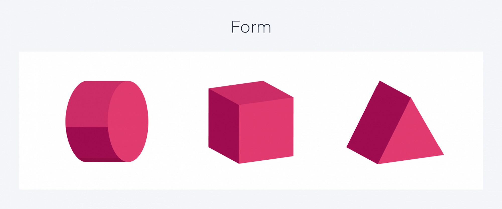
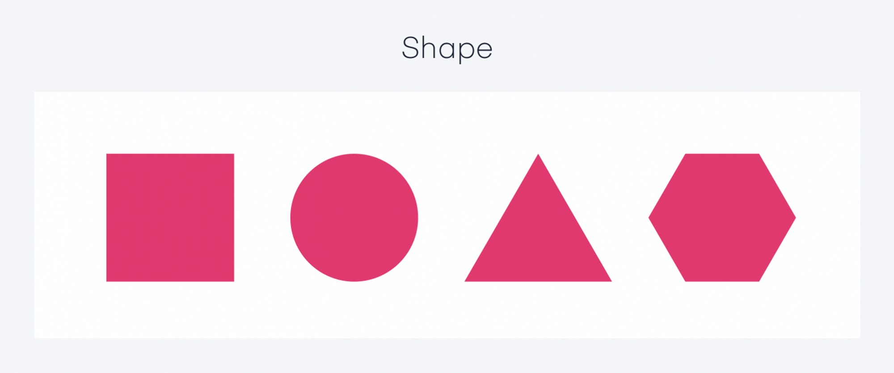
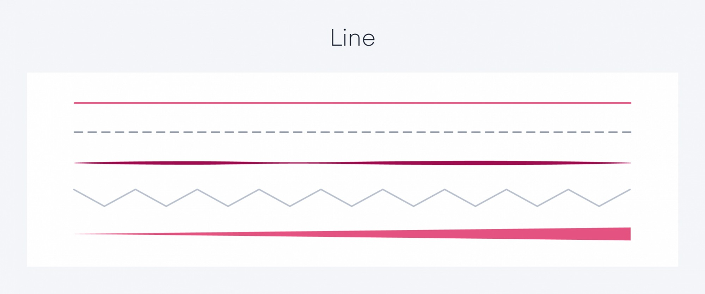
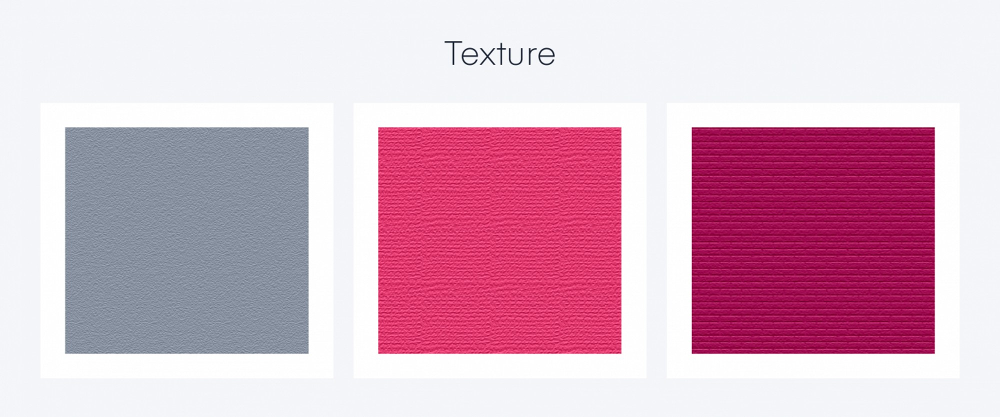
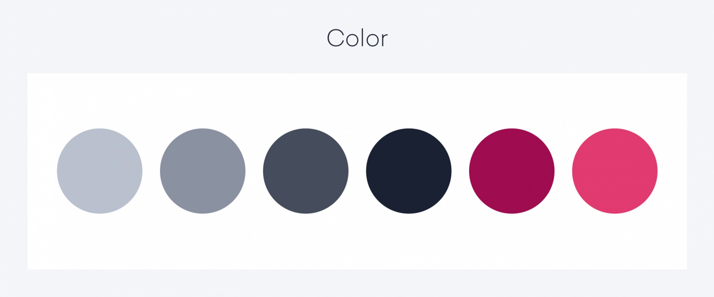
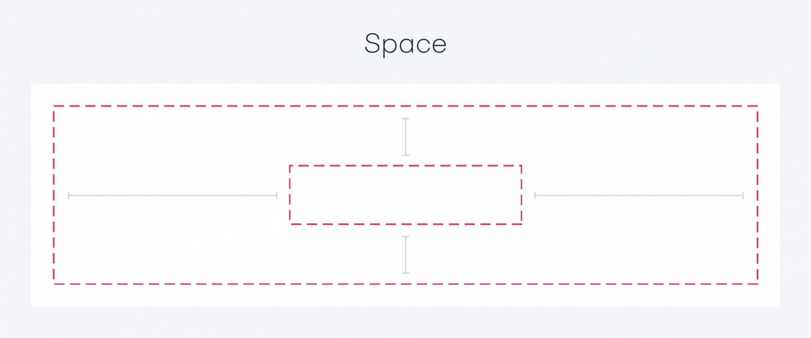
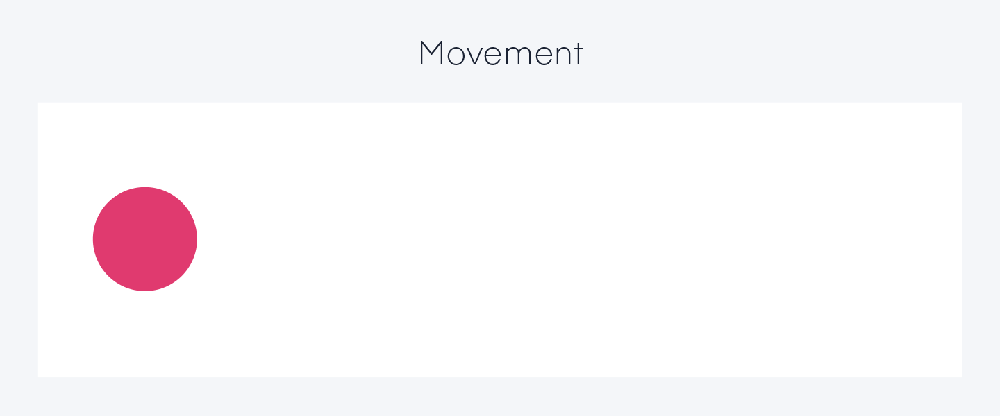

# Elements of Design

## FORM

Everything posses a form in one way or another. When we talk about form, we’re not talking about the content of the form, but the form itself.

Forms are three dimensional, and there are two types: geometric (man-made) and natural (organic). A digital or physical form can be measured by height, width, and depth. A form can be created by combining shapes, and it can be enhanced by color or texture. Depending on their usage, they can also be ornate or utilitarian.

For digital design, think of form as the object you’re designing for; so if you’re designing for a mobile device, the phone is your form.

<figure><figcaption></figcaption></figure>

## SHAPE

All objects are composed of shapes, and all elements of design are shapes in some way. Shapes can live in a form. An example would be a button on a website: It’s a shape that’s living inside the computer (which is the form).

A shape is a two- or three-dimensional object that stands out from the space next to it because of a defined or implied boundary. A shape can live in different areas in space, and have other elements like line, color, texture, or movement. Like forms, shapes come in two different types: geometric and organic.

Geometric shapes can be drawn using a ruler, compass, or digital instrument. They feel very precise, like an architecture rendering. They’re created in CAD or by hand, and are controlled and orderly. Organic shapes are found in nature or drawn by hand. They’re the opposite of geometric, and often feel natural or smooth. That’s not to say that because they’re natural, they’re less complex. Think of the grain on a stump of wood: It’s complex, but not geometrically precise.

With the advent of computer-aided design, the definition of “hand drawn” has blurred. But as long as they’re performed free hand, organic shapes can be created with a mouse, digital pen, or tablet.

<figure><figcaption></figcaption></figure>

## LINE

Often the starting point for all artistic expression, the line is one of the most essential elements of design. It always has more length than thickness, and can be unbroken, broken, or implied. A line can be vertical, diagonal, horizontal, and even curved. It can be any width, size, shape, position, direction, interval, or density.

Points create lines and lines create shapes. A line can have other elements like color, texture, and movement applied to it. Though basic in appearance, lines can control the viewer’s thoughts and emotions, and lead a viewer’s eye through space.

In digital design, the line is commonly used to contain or break areas apart visually. For example, a navigation bar could have a line to divide itself from the content.

<figure><figcaption></figcaption></figure>

## TEXTURE

Texture is the way a surface feels, or the way it’s perceived to feel. It has the power to attract or detract a viewer’s eyes, and can be applied to lines, shapes, and forms.

There are two types of texture: tactile and visual. Tactile textures are three-dimensional and can be touched. The easiest example is tree bark. When you touch bark, you can feel all the bumps and ridges, the roughness and smoothness. A photo of the same bark would be a visual texture. You can see it, not feel it.

In digital design, there are currently no touch screens that emulate tactile textures—yet. So we stick to visual textures.

<figure><figcaption></figcaption></figure>

## COLOR

Color is one of the hardest elements to harness, and probably one of the most challenging to understand. The basics, however, are relatively easy.

Color can help the organization of a design, and give emphasis to specific areas or actions. Like other elements, it has a few different properties: hue, saturation, and lightness. Unlike other elements, it does not always have to be used. A design can have the absence of color (yes, black and white are still colors, but you get the point). Color can be used sparingly or in a rainbow of hues, but tends to work best when there’s both a dominant color and a supporting color.

Hue typically references a wavelength of light in the color spectrum, which is blended from the primary colors of red, green, and blue (commonly referred to as RGB). A specific hue can have a vibrant or dull saturation. Cyan, baby blue, navy blue, and royal blue are blue hues that are more or less intense. A color can also be on the light or dark end of the spectrum.

<figure><figcaption></figcaption></figure>

## SPACE

Every shape or form has a place in space. As an element of design, space refers to the area around, above, below, or behind an object.

Objects in space can occur in both two and three dimensions. In a two-dimensional setting, space is about creating the illusion of a third dimension on a flat surface. Shadows, shading, overlap, and sizing can help define an object’s place in space. For example, a button could have a shadow that makes it feel like it’s closer to the user.

Space, like color, is an element that does not have to be used. But when it is, it’s a powerful way to add emphasis.

<figure><figcaption></figcaption></figure>

## MOVEMENT

A proposed seventh element in the age of digital design is movement.

In classical or more static design methods, movement can be implied, but objects cannot move. Movement can be applied to lines, shapes, forms, and textures, and can even move objects in space. This is particularly useful because it allows your forms or shapes to take on a personality or tell a story. An example in a static medium is a cartoon where an artist has created the perception of movement with action lines or blurred areas. Movement can also be applied to physical experiences where users interact with their space.

Movement has grown popular in apps and interfaces because it allows designers to create a timeline or sequence of events to mask transitions or loading screens. If a user taps on a button, the button can animate off the canvas and the next page can slide into view. This allows the designer to keep a user engaged through animations and/or give them feedback when they’ve interacted with a specific part of the interface.

<figure><figcaption></figcaption></figure>
