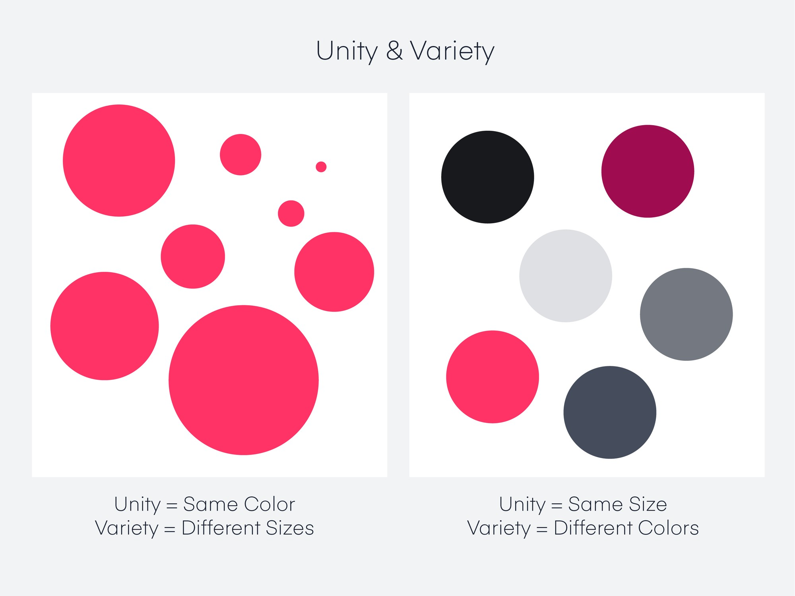
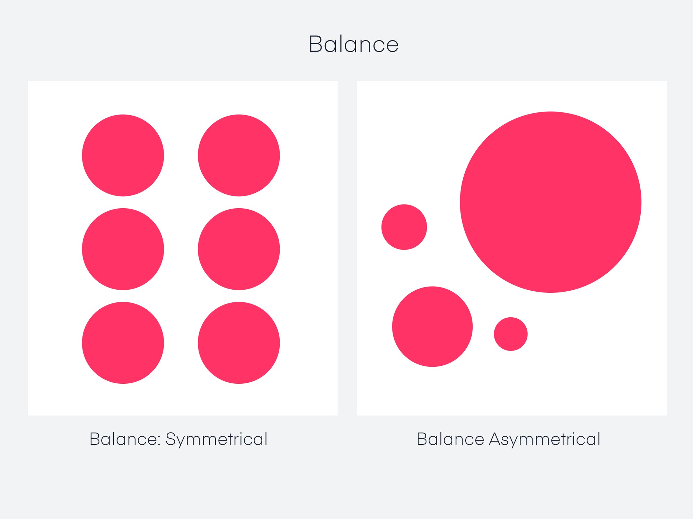
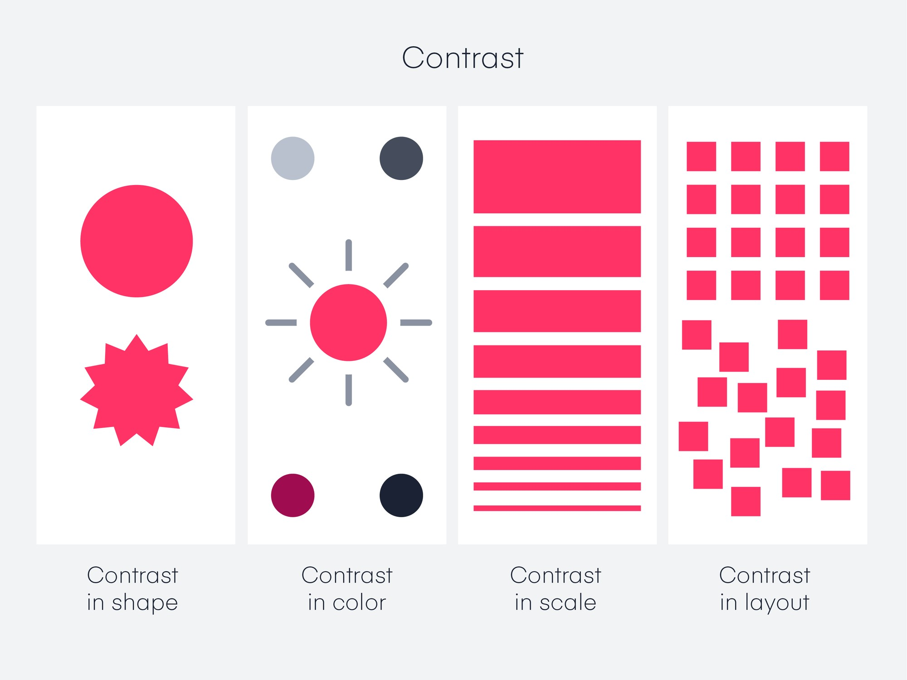
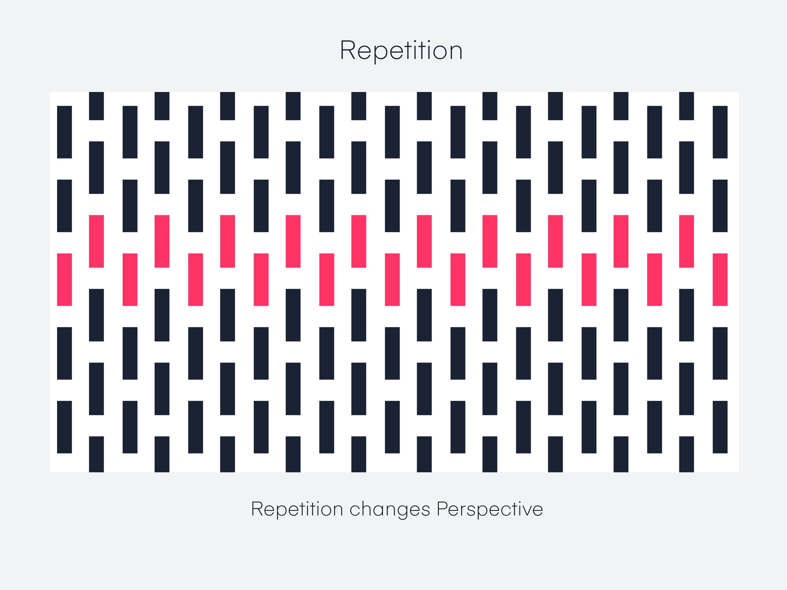

# Principles of Design

## What are the Principles of Design?

Classic and digital designers alike harness the principles of design to shape their work, building on top of the elements of design to give cohesion to their pieces. When used successfully, these principles have the ability to transform designs, both aesthetically and in terms of performance.

### Unity

Unity is a force operating within a design that gives it the appearance of oneness or resolution. This ensures no single part is more important than the other. Author of _The Elements of Graphic Design_ Alex White explains, “To achieve visual unity is the main goal of graphic design. When all elements are in agreement, a design is considered unified.”

Using design elements to apply unity to your work is a strong way to bring a brand concept to life. Let’s say a sports brand like Nike or Reebok has an intense “in your face” campaign. They might use big bold fonts, bright colors, and highly stylized imagery to exude intense training emotions. On the flip side, a company like Casper might use a more subdued palette with bright white tones and light, airy fonts to emulate a restful night sleep.

<figure><figcaption></figcaption></figure>

### Balance

Objects in design carry weight just like in the physical world, but it’s called visual weight. The visual weight of a design needs to have balance. It’s like putting two objects on a seesaw: If one side is too heavy, the viewer’s eye goes directly to the heavy part. If it’s weighted with all things equal, the seesaw is perfectly suspended without either side touching the ground.

Balance can be implied by size, shape, or even contrast. While it can utilize symmetry or equality, balance can also be achieved through asymmetry. Think of asymmetry as the opposite of mirroring: Instead of seeing the reflection, you see something that evenly distributes the elements. For example, three small objects can offset the visual weight of one large object. Or a small, dark, and shaded object can offset the visual weight of a large, lighter element.

<figure><figcaption></figcaption></figure>

### Hierarchy

One of the most important principles in design, hierarchy is a way to visually rank your design elements.

Hierarchy is not based on a design styles, but rather the order of importance. A good design leads the eye through each area in priority order. A good example is a homepage: There’s usually a navigation bar and a logo, some sort of large header image, or text with a call to action. In order of importance, the logo tells the user where they are; the site navigation shows the user how to get around the site; and the call to action compels the user to do something. More often than not, the CTA is the biggest or boldest element on the page, followed by the logo and navigation. It’s designed to help the user complete an action or absorb information.

Another example is this article. The headline is the most important thing on the page so you can identify what you’re reading; the intro gives you a summary of the article; and the content gives you the meat of the design principles. If we read the article from bottom to top, it wouldn’t make much sense.

A good rule of thumb for hierarchy is that your most important elements should be the most prominent.

<figure><figcaption></figcaption></figure>

### Contrast

The difference between two or more objects in a design is referred to as contrast. The difference in objects could be light and dark, thin and thick, small and large, bright and dull, etc.

Contrast is most commonly associated with readability, legibility, and accessibility. Like hierarchy, the most important element in a design should have the most contrast. A bright blue button on a stark white background with a lot of white space is considered high contrast. If the button was almost the same color as the background or was a 1px stroke versus a fill, it would have less contrast.

A text-based design could be high contrast by using black text on a white background. To dial down the contrast, you’d use gray text on a white background. An easy reminder is to think of a black-and-white photo. If the photo has a full range of white, gray, and black, it has high contrast. If the photo only goes from a dull white to dark gray, it’s a low-contrast image.

<figure><figcaption></figcaption></figure>

### Emphasis

Emphasis can be created by size, weight, position, color, shape, and style. Sometimes referred to as dominance, emphasis might seem similar to contrast, but it’s not quite the same. Contrast deals with the difference between two objects, and emphasis deals with the impact of an object. To make it a little more confusing, you can use contrast to support the emphasis of an object—like placing a solid black sphere on a white background. This is high contrast with emphasis: The viewer’s eye is drawn directly to the heavy shape.

Adding emphasis to an object creates a focal point, which grabs an audience’s attention. It’s where you want the viewer to look first, but doesn’t overpower the rest of the design (or it would be out of balance). A simple example is a long hallway or corridor, where your eye is drawn to the end of the hallway. Imagine painting a bright wall at the end: That’s your focal point.

<figure><figcaption></figcaption></figure>

### Scale

Scale is the sizing of elements or a standard of measurement. It can be used in combination with other principles like emphasis to draw the viewer into a focal point, and helps us make sense of designs or imagery. If something is drawn to scale, it shows an object with accurate sizing (though it could be reduced or enlarged from its actual size). This creates a way to depict objects as larger than life, or bring a large object down to fit on a piece of paper.

In digital design, scale can also refer to the pixel dimensions for the device you’re designing for. Sometimes two to three times as dense as their non-retina counterparts, retina devices need a scaled canvas. Depending on the device, this could be 2x or 3x the amount of the display. For example: A 400px-wide box is still rendered as 400px on a retina device, but it’s twice as dense. So you would design on a 800px-wide canvas because it’s 2x the density of a non-retina or 1x device.

<figure><figcaption></figcaption></figure>

### Repetition

Repetition is the recurrence of a design element, commonly utilized in patterns or textures. Repetitive elements can be used in conjunction with other principles to create a design that leads a user’s eye to a focal point, has continuity, or flow. A repetitive element could be repeated lines, shapes, forms, color, or even design elements.

<figure><figcaption></figcaption></figure>
